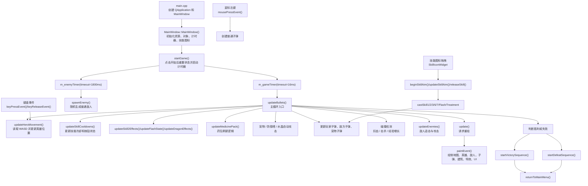
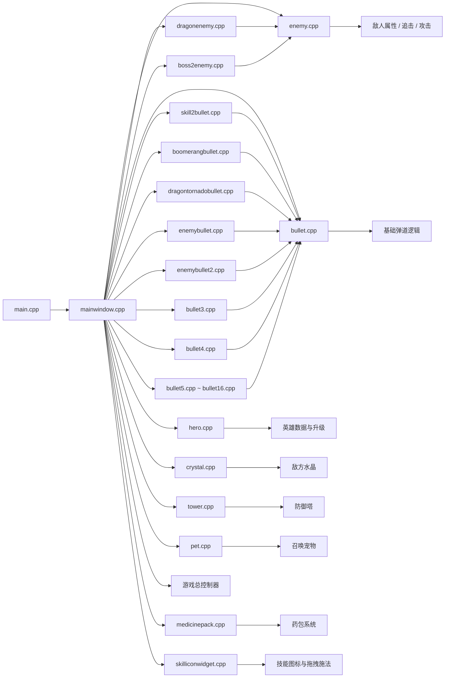

# 游戏运行逻辑图

下面两张图都可以直接复制到支持 Mermaid 的编辑器里导出，或者在支持 Mermaid 的 Markdown 预览中截图后放进 Word。

## 预览提示

- `Ctrl+Shift+V`：打开 Markdown 预览
- `Ctrl+K V`：在侧边打开 Markdown 预览
- 如果 Mermaid 没有显示，通常是 VS Code 版本太旧，更新后即可正常预览

## 1. 游戏运行时逻辑图

## 2. 各 cpp 文件之间关系图

## 3. 建议放进 Word 的说明文字

可以在图下方写：

“从程序结构上看，`mainwindow.cpp` 是整个项目的核心调度中心，它负责连接输入、计时器、渲染和战斗逻辑。`hero.cpp`、`enemy.cpp`、`bullet.cpp` 等文件分别负责不同对象的属性与行为；而 `skill2bullet.cpp`、`boomerangbullet.cpp`、`dragontornadobullet.cpp` 等文件则在基础子弹类的基础上扩展出不同技能效果。整个程序形成了较清晰的主控层、对象层和特效层结构。”
