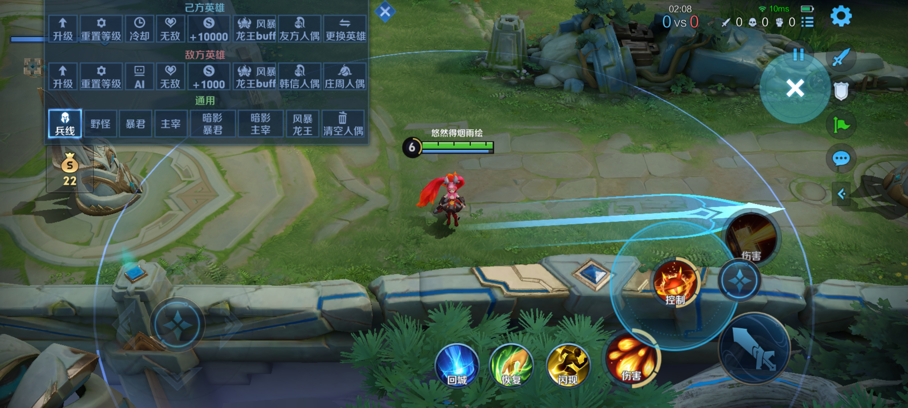
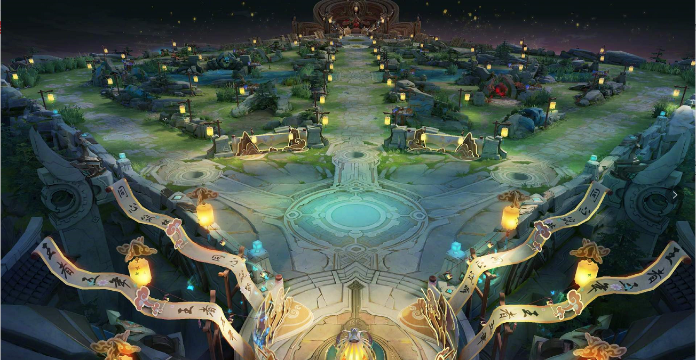

# Honor of Hero 项目总结

## 项目图片预览

打开 VS Code 的 Markdown Preview 后，下面这些图片会按相对路径直接显示。

快捷键：
- `Ctrl+Shift+V`：在当前页打开预览
- `Ctrl+K V`：在侧边打开预览

### 游戏截图

### 地图总览

### 主战场

## 1. 项目概述

本项目是一个基于 Qt Widgets 和 C++ 开发的 2D 即时战斗游戏，整体玩法参考 MOBA 游戏中的“英雄推进拆塔”模式。玩家控制英雄安琪拉在地图中移动、普攻、释放技能、升级，并在敌方小兵、远程单位、Boss、塔和水晶的攻击下生存，最终目标是摧毁敌方水晶获得胜利；如果英雄血量归零，则进入失败结算。

从程序结构上看，项目采用“主窗口统一调度 + 独立对象类封装行为”的设计思路：

- `main.cpp` 负责启动 Qt 应用和创建主窗口。
- `mainwindow.cpp` 负责游戏主循环、输入处理、渲染、碰撞检测、技能调度、敌人生成、胜负判定等核心逻辑。
- `hero.cpp`、`enemy.cpp`、`bullet.cpp`、`tower.cpp`、`crystal.cpp`、`pet.cpp` 等文件分别封装不同对象的属性与行为。
- `skilliconwidget.cpp` 负责技能图标、拖拽施法和冷却显示，是 UI 与战斗逻辑之间的重要桥梁。

## 2. 游戏设计思路

### 2.1 核心玩法设计

游戏设计围绕“英雄成长 + 技能战斗 + 推塔拆家”三个核心点展开。

1. 玩家控制安琪拉在地图中移动，通过鼠标左键发射普通子弹，通过拖拽技能图标确定技能方向。
2. 击败敌人后，英雄获得经验值并升级，不同等级会逐步解锁新的技能能力。
3. 敌人会持续生成并朝英雄推进，部分敌人具有远程攻击能力，Boss 还会释放更强的特殊弹道。
4. 敌方防御塔和水晶会自动对英雄进行远程攻击，进一步增强战斗压力。
5. 玩家需要利用扇形火球、强化火球、激光、回旋镖、宠物、闪现、治疗等能力突破敌方防线。
6. 当玩家子弹命中敌方水晶并将其血量降为 0 时，进入胜利动画；当英雄血量降为 0 时，进入失败动画。

### 2.2 程序架构设计

本项目没有采用复杂的 ECS 或多场景架构，而是采用更适合课程设计的面向对象方式：

- `MainWindow` 作为“总控制器”，统一维护所有游戏对象容器，如 `m_bullets`、`m_enemies`、`m_towers`。
- 每个对象类只处理自己的局部逻辑，例如英雄只负责生命值、经验、位置更新；敌人只负责朝目标移动、攻击判定、击退等。
- 游戏帧循环由 `QTimer` 驱动，主定时器每 16ms 触发一次，相当于约 60 FPS。
- 渲染统一放在 `paintEvent()` 中执行，逻辑更新和画面绘制实现了解耦。

这种设计的优点是结构清晰、便于扩展，也很适合在答辩时解释“谁负责什么”。

## 3. 主要运行流程

### 3.1 启动流程

- `main.cpp` 第 8 行：程序入口 `main()`。
- `main.cpp` 第 12 行：创建 `QApplication`。
- `main.cpp` 第 14 行：创建 `MainWindow w;`。
- `main.cpp` 第 16 行：调用 `w.show()` 显示主窗口。
- `main.cpp` 第 18 行：进入 `a.exec()` 事件循环。

### 3.2 游戏主循环

游戏主循环建立在 `MainWindow` 构造函数中：

- `mainwindow.cpp` 第 205 行：`MainWindow::MainWindow()` 构造主窗口。
- `mainwindow.cpp` 第 212-215 行：创建 `m_gameTimer`，每 16ms 触发一次，并连接到 `updateBullets()`。
- `mainwindow.cpp` 第 348-350 行：创建 `m_enemyTimer`，每 1800ms 触发一次，并连接到 `spawnEnemy()`。

实际每一帧的更新入口是：

- `mainwindow.cpp` 第 1560 行：`MainWindow::updateBullets()`

这个函数按顺序完成以下工作：

1. 更新英雄移动。
2. 更新技能冷却与特效状态。
3. 更新药包刷新与闪现状态。
4. 更新宠物行为、塔和水晶的自动攻击。
5. 更新玩家子弹、敌方子弹、宠物子弹。
6. 进行碰撞检测并处理扣血、击杀、经验增长。
7. 更新敌人移动与攻击。
8. 判断英雄死亡或水晶被摧毁。
9. 调用 `update()` 触发重绘。

## 4. 各功能实现逻辑

### 4.1 安琪拉移动功能

安琪拉移动主要由两个函数配合完成：

- `mainwindow.cpp` 第 1963 行：`MainWindow::updateHeroMovement()`
- `hero.cpp` 第 161 行：`hero::updatePos(const QPointF &velocity, int gameWidth, int gameHeight)`

实现逻辑如下：

1. 在 `keyPressEvent()` 中记录 `W/A/S/D` 按键状态。
   - `mainwindow.cpp` 第 899 行：`MainWindow::keyPressEvent()`
   - `mainwindow.cpp` 第 915-921 行：将按键加入 `m_pressedMovementKeys`
2. 在 `keyReleaseEvent()` 中移除按键状态。
   - `mainwindow.cpp` 第 935 行：`MainWindow::keyReleaseEvent()`
   - `mainwindow.cpp` 第 942-947 行：从 `m_pressedMovementKeys` 中移除按键
3. 在每帧更新时，`updateHeroMovement()` 根据按键集合计算方向向量。
4. 通过 `std::hypot()` 对方向做归一化，避免斜向移动更快。
5. 利用
   `m_heroVelocity = m_heroVelocity * (1.0 - kHeroMoveAcceleration) + targetVelocity * kHeroMoveAcceleration;`
   实现平滑加速。
6. 当玩家松开按键时，使用 `m_heroVelocity *= kHeroMoveBrake;` 实现减速。
7. 最终调用 `hero::updatePos()` 修改角色精确坐标，并通过 `std::clamp()` 限制角色不能移出地图边界。

“主逻辑在 `MainWindow::updateHeroMovement()` 中完成，真正的位置更新由 `hero::updatePos()` 执行，分别位于 `mainwindow.cpp` 第 1963 行和 `hero.cpp` 第 161 行。”

### 4.2 普通攻击功能

普通攻击使用鼠标左键触发，核心位置如下：

- `mainwindow.cpp` 第 956 行：`MainWindow::mousePressEvent()`
- `mainwindow.cpp` 第 1000-1002 行：创建普通子弹
- `bullet.cpp` 第 28 行：`Bullet::Bullet(...)`
- `bullet.cpp` 第 66 行：`Bullet::update()`
- `bullet.cpp` 第 77 行：`Bullet::paint(QPainter &painter) const`

实现逻辑如下：

1. 玩家点击鼠标左键后，在 `mousePressEvent()` 中检测输入。
2. 程序根据英雄发射点 `myHero->shootOrigin()` 和鼠标点击位置创建 `Bullet` 对象。
3. 在 `Bullet` 构造函数中，通过 `QLineF` 计算起点和目标点的方向向量。
4. 在 `Bullet::update()` 中通过 `m_pos += m_velocity;` 实现弹道飞行。
5. 在 `updateBullets()` 中检测子弹是否出界、是否达到最远距离、是否与敌人或建筑发生碰撞。

### 4.3 技能 1：扇形火球

核心代码位置：

- `mainwindow.cpp` 第 2249 行：`beginSkillAim()`
- `mainwindow.cpp` 第 2257 行：`updateSkillAim()`
- `mainwindow.cpp` 第 2276 行：`releaseSkill()`
- `mainwindow.cpp` 第 2312 行：`castSkill1()`

实现逻辑：

1. 玩家拖拽技能图标时，由 `SkillIconWidget` 回调给主窗口。
2. `updateSkillAim()` 根据拖拽向量记录技能方向 `m_skillDirection`。
3. 释放鼠标后，`releaseSkill()` 根据当前技能类型调用 `castSkill1()`。
4. `castSkill1()` 中设置 6 发子弹、总散射角度 60 度。
5. 通过 `rotated(m_skillDirection, radians)` 生成不同角度的方向，形成扇形攻击效果。

### 4.4 技能 2：强化火球 + 范围伤害 + 击退

核心代码位置：

- `mainwindow.cpp` 第 2334 行：`castSkill2()`
- `skill2bullet.cpp` 第 9 行：`Skill2Bullet::Skill2Bullet(...)`
- `skill2bullet.cpp` 第 22 行：`Skill2Bullet::damage() const`
- `mainwindow.cpp` 第 2346 行：`applySkill2AreaDamage(...)`
- `enemy.cpp` 第 302 行：`Enemy::applyKnockback(...)`

实现逻辑：

1. `castSkill2()` 创建一个 `Skill2Bullet` 对象。
2. `Skill2Bullet` 继承自 `Bullet`，但体积更大、伤害更高。
3. 在 `updateBullets()` 中，如果检测到该子弹命中敌人，会调用 `applySkill2AreaDamage()`。
4. 该函数会遍历所有敌人，判断其是否在爆炸半径内。
5. 命中的敌人会受到伤害，并调用 `Enemy::applyKnockback()` 实现击退。
6. 同时记录爆炸特效到 `m_skill2Explosions`，供渲染函数绘制。

### 4.5 技能 3：激光扫射

核心代码位置：

- `mainwindow.cpp` 第 2386 行：`castSkill3()`
- `mainwindow.cpp` 第 2604 行：`updateSkill3Effect()`
- `mainwindow.cpp` 第 3035 行：`drawSkill3Effect(QPainter &painter) const`

实现逻辑：

1. `castSkill3()` 激活技能状态 `m_skill3Active = true`，记录基础方向 `m_skill3BaseDirection`。
2. `updateSkill3Effect()` 每帧更新技能时间进度 `m_skill3Elapsed`。
3. 程序根据进度计算扫射偏移角度，让激光在一定角度范围内摆动。
4. 用 `distancePointToSegment()` 判断敌人与激光线段的距离，若距离足够近则视为命中。
5. 已命中的敌人会记录到 `m_skill3HitEnemies`，避免同一目标被同一轮重复伤害。
6. `drawSkill3Effect()` 负责把激光贴图旋转到当前方向并绘制出来。

### 4.6 技能 6：回旋镖

核心代码位置：

- `mainwindow.cpp` 第 2414 行：`castSkill6()`
- `boomerangbullet.cpp` 第 29 行：`BoomerangBullet::BoomerangBullet(...)`
- `boomerangbullet.cpp` 第 54 行：`BoomerangBullet::update()`
- `boomerangbullet.cpp` 第 144 行：`BoomerangBullet::canHitEnemy(const Enemy *enemy) const`
- `boomerangbullet.cpp` 第 155 行：`BoomerangBullet::registerEnemyHit(const Enemy *enemy)`

实现逻辑：

1. 技能 6 在英雄等级达到 2 级后解锁。
2. `castSkill6()` 创建 `BoomerangBullet`，并传入一个返回目标函数，用于告诉回旋镖“返回时该飞向哪里”。
3. `BoomerangBullet::update()` 先执行去程飞行，达到最远距离后切换到返程。
4. 回旋镖在去程和返程分别维护命中集合，防止同一阶段对同一敌人重复造成伤害。
5. 当回旋镖回到英雄附近时，子弹状态结束并被移除。

### 4.7 技能 7：召唤宠物

核心代码位置：

- `mainwindow.cpp` 第 2430 行：`castSkill7()`
- `pet.cpp` 第 34 行：`Pet::summon(const QPointF &heroCenter)`
- `pet.cpp` 第 53 行：`Pet::update(const QPointF &heroCenter, qreal deltaMs)`
- `pet.cpp` 第 64 行：`Pet::tryShootAt(const QPointF &targetPos, qreal deltaMs)`

实现逻辑：

1. 技能 7 在英雄等级达到 3 级后解锁。
2. `castSkill7()` 调用 `Pet::summon()` 激活宠物。
3. 每一帧中，`updateBullets()` 会先调用 `m_pet->update()`，让宠物围绕英雄公转。
4. 主循环会寻找距离宠物最近的敌人。
5. 如果宠物攻击冷却结束，则创建宠物子弹 `m_petBullets.push_back(new Bullet(...))` 对敌人自动射击。

### 4.8 E 键弹幕轮盘

核心代码位置：

- `mainwindow.cpp` 第 899 行：`keyPressEvent()`
- `mainwindow.cpp` 第 922-925 行：按下 `E` 触发 `castBulletWheel()`
- `mainwindow.cpp` 第 2457 行：`castBulletWheel()`

实现逻辑：

1. 按下 `E` 后触发环形技能。
2. `castBulletWheel()` 以英雄中心为圆心，把 360 度均分为 12 份。
3. 程序使用 `cos/sin` 生成 12 个方向，并发射 12 种不同贴图的子弹 `Bullet5` 到 `Bullet16`。
4. 同时记录 `m_bulletWheelBursts`，在渲染时绘制爆发环形特效。

### 4.9 闪现功能

核心代码位置：

- `mainwindow.cpp` 第 2531 行：`castFlash()`
- `mainwindow.cpp` 第 1893 行：`updateFlashState()`
- `mainwindow.cpp` 第 2954 行：`drawFlashEffect(QPainter &painter) const`

实现逻辑：

1. 玩家拖拽闪现图标指定方向。
2. `castFlash()` 根据 `m_skillDirection` 计算目标点。
3. 使用 `std::clamp()` 保证闪现不会超出地图边界。
4. 通过 `myHero->setPosition(targetX, targetY)` 直接完成瞬移。
5. 再配合 `drawFlashEffect()` 绘制拖影和冲击光效。

### 4.10 治疗功能

核心代码位置：

- `mainwindow.cpp` 第 2521 行：`castTreatment()`
- `hero.cpp` 第 49 行：`hero::heal(int amount)`

实现逻辑：

1. 点击治疗图标后调用 `castTreatment()`。
2. 如果冷却结束，则调用 `myHero->heal(kTreatmentHealAmount)` 回复生命值。
3. `hero::heal()` 内部会限制血量上限，避免超过最大生命值。

### 4.11 敌人生成与 AI 追击

核心代码位置：

- `mainwindow.cpp` 第 2009 行：`spawnEnemy()`
- `mainwindow.cpp` 第 2043 行：`spawnDragonEnemy()`
- `mainwindow.cpp` 第 2053 行：`spawnBoss2Enemy()`
- `mainwindow.cpp` 第 2063 行：`spawnBoss3Enemy()`
- `mainwindow.cpp` 第 2073 行：`updateEnemies()`
- `enemy.cpp` 第 273 行：`Enemy::updateToward(const QPointF &targetPos)`
- `enemy.cpp` 第 286 行：`Enemy::tryAttackTarget(const QPointF &targetPos, qreal deltaMs)`

实现逻辑：

1. `spawnEnemy()` 从多个敌人类型中随机抽取一种并生成在地图路径附近。
2. `updateEnemies()` 每帧根据敌人类型决定其行为：
   - 近战敌人靠近英雄后直接攻击。
   - 远程敌人接近到攻击半径内后发射子弹。
   - Boss 保持一定追击距离，并释放更强技能弹道。
3. `Enemy::updateToward()` 负责朝目标点移动。
4. `Enemy::tryAttackTarget()` 负责冷却计时和攻击触发判断。

### 4.12 敌人重叠分离

核心代码位置：

- `mainwindow.cpp` 第 2142 行：`resolveEnemyOverlap()`

实现逻辑：

1. 遍历所有敌人两两之间的包围盒。
2. 若包围盒相交，则计算两者中心点分离向量。
3. 根据穿透深度生成柔和推开距离。
4. 最后通过 `enemyA->setCenter()`、`enemyB->setCenter()` 修正位置。

这样可以避免多个敌人完全堆叠在一起，增强画面可读性和战斗真实感。

### 4.13 防御塔与水晶自动攻击

核心代码位置：

- `crystal.cpp` 第 110 行：`Crystal::tryShootAt(...)`
- `tower.cpp` 第 111 行：`Tower::tryShootAt(...)`
- `mainwindow.cpp` 第 1637-1646 行：在主循环中让水晶和塔向英雄发射子弹
- `bullet3.cpp` 第 8 行：水晶子弹 `Bullet3`
- `bullet4.cpp` 第 8 行：防御塔子弹 `Bullet4`

实现逻辑：

1. 水晶和塔内部都维护自己的攻击冷却时间。
2. 每一帧中，主循环调用它们的 `tryShootAt(heroCenter(), deltaMs)`。
3. 若冷却结束，就在主窗口中创建对应的远程子弹对象。
4. 水晶子弹伤害更高，塔子弹可以按飞行方向旋转绘制。

### 4.14 经验与升级系统

核心代码位置：

- `hero.cpp` 第 61 行：`hero::gainExperience(int amount)`
- `mainwindow.cpp` 第 2200 行：`handleEnemyDefeat(int enemyIndex)`

实现逻辑：

1. 敌人死亡后，`handleEnemyDefeat()` 会根据敌人类型发放经验。
2. 英雄通过 `gainExperience()` 增加经验值。
3. 当经验达到阈值后，英雄等级提升。
4. 等级提升后，技能 6、技能 7 等会被解锁，主界面按钮也会同步启用。

### 4.15 药包刷新与拾取

核心代码位置：

- `medicinepack.cpp` 第 70 行：`MedicinePack::spawn()`
- `medicinepack.cpp` 第 75 行：`MedicinePack::consume()`
- `mainwindow.cpp` 第 1947 行：`updateMedicinePack()`
- `mainwindow.cpp` 第 1735-1741 行：检测英雄拾取药包

实现逻辑：

1. 药包被拾取后会调用 `consume()` 隐藏。
2. 主循环中通过 `m_medicineRespawnCountdownMs` 控制刷新倒计时。
3. 倒计时结束后调用 `spawn()`，药包再次出现在地图中央附近。

### 4.16 胜利、失败和暂停功能

核心代码位置：

- `mainwindow.cpp` 第 1077 行：`startDefeatSequence()`
- `mainwindow.cpp` 第 1135 行：`startVictorySequence()`
- `mainwindow.cpp` 第 1193 行：`returnToMainMenu()`
- `mainwindow.cpp` 第 1406 行：`togglePause()`
- `mainwindow.cpp` 第 1415 行：`setPaused(bool paused)`

实现逻辑：

1. 在 `updateBullets()` 中：
   - 如果英雄血量小于等于 0，则调用 `startDefeatSequence()`。
   - 如果水晶血量小于等于 0，则调用 `startVictorySequence()`。
2. 胜负结算会停止主循环和敌人生成计时器，播放音效和帧动画。
3. 动画播放完成后调用 `returnToMainMenu()` 返回主菜单。
4. 暂停按钮通过 `togglePause()` / `setPaused()` 实现，暂停时会停止计时器、清空移动输入，并禁用技能控件。

## 5. 绘制与界面实现思路

### 5.1 主渲染函数

核心位置：

- `mainwindow.cpp` 第 599 行：`MainWindow::paintEvent(QPaintEvent *event)`

绘制顺序大致如下：

1. 若处于胜利/失败动画，则优先播放对应帧图。
2. 若尚未开始游戏，则绘制开始菜单、关于页面或图标展示页面。
3. 若进入战斗，则先根据 `cameraOffset()` 绘制大地图。
4. 再绘制英雄、血条、药包、宠物、瞄准箭头、各种子弹、敌人、塔、水晶。
5. 最后绘制技能爆炸、轮盘爆发、龙卷风攻击、激光等特效。

### 5.2 技能图标交互

核心位置：

- `skilliconwidget.cpp` 第 111 行：`paintEvent()`
- `skilliconwidget.cpp` 第 191 行：`mousePressEvent()`
- `skilliconwidget.cpp` 第 207 行：`mouseMoveEvent()`
- `skilliconwidget.cpp` 第 220 行：`mouseReleaseEvent()`

技能图标类的作用有三个：

1. 显示图标本身。
2. 显示技能冷却遮罩和剩余秒数。
3. 把拖拽偏移量通过回调发给 `MainWindow`，从而实现方向性技能施法。

## 6. 文件分工说明

### 6.1 核心控制层

- `main.cpp`：程序入口。
- `mainwindow.h / mainwindow.cpp`：游戏主逻辑、主循环、输入控制、渲染、状态管理。

### 6.2 角色与战斗对象层

- `hero.h / hero.cpp`：英雄基础属性、生命、经验、位置。
- `enemy.h / enemy.cpp`：敌人基础属性、移动、攻击、受伤、绘制。
- `dragonenemy.h / dragonenemy.cpp`：龙 Boss 类型封装。
- `boss2enemy.h / boss2enemy.cpp`：第二类 Boss 封装。

### 6.3 子弹与技能层

- `bullet.h / bullet.cpp`：普通子弹基类。
- `skill2bullet.*`：强化火球。
- `boomerangbullet.*`：回旋镖。
- `dragontornadobullet.*`：Boss 龙卷风弹道。
- `enemybullet.*`、`enemybullet2.*`：敌方远程弹道。
- `bullet3.*`、`bullet4.*`：水晶和防御塔子弹。
- `bullet5.*` 到 `bullet16.*`：轮盘弹幕的 12 种特效子弹。

### 6.4 地图建筑与辅助层

- `tower.*`：防御塔。
- `crystal.*`：敌方水晶。
- `pet.*`：召唤宠物。
- `medicinepack.*`：药包系统。
- `skilliconwidget.*`：技能图标控件和冷却显示。

## 7. 项目亮点总结

我认为本项目的主要亮点有以下几点：

1. 不是简单的“点击发射子弹”小游戏，而是设计了完整的英雄成长、技能释放、敌人 AI、建筑攻击和胜负系统。
2. 通过 `QTimer + paintEvent()` 实现了接近实时游戏的循环结构，具备较强的完整性。
3. 技能系统设计较丰富，包含方向拖拽、范围伤害、持续激光、召唤宠物、位移、回复等多种机制。
4. 在表现层面加入了音效、动画帧、爆炸特效、拖影特效、冷却遮罩等内容，使游戏可玩性和观感更强。
5. 文件划分较清楚，说明项目不仅实现了功能，也考虑了程序结构和后续维护。

## 8. 答辩时可直接使用的总结语

本项目使用 C++ 和 Qt Widgets 实现了一个 2D 即时战斗游戏。开发过程中，我采用了主窗口统一调度、各对象类独立封装的设计方式。主窗口负责计时器驱动、输入控制、碰撞检测、技能释放和胜负判断，而英雄、敌人、子弹、塔、水晶、宠物等对象分别在各自的类中管理属性和行为。项目重点完成了角色移动、普通攻击、技能系统、敌人 AI、升级系统、建筑攻击系统、道具刷新系统以及胜负动画等功能，最终形成了一个较完整的课程设计作品。
